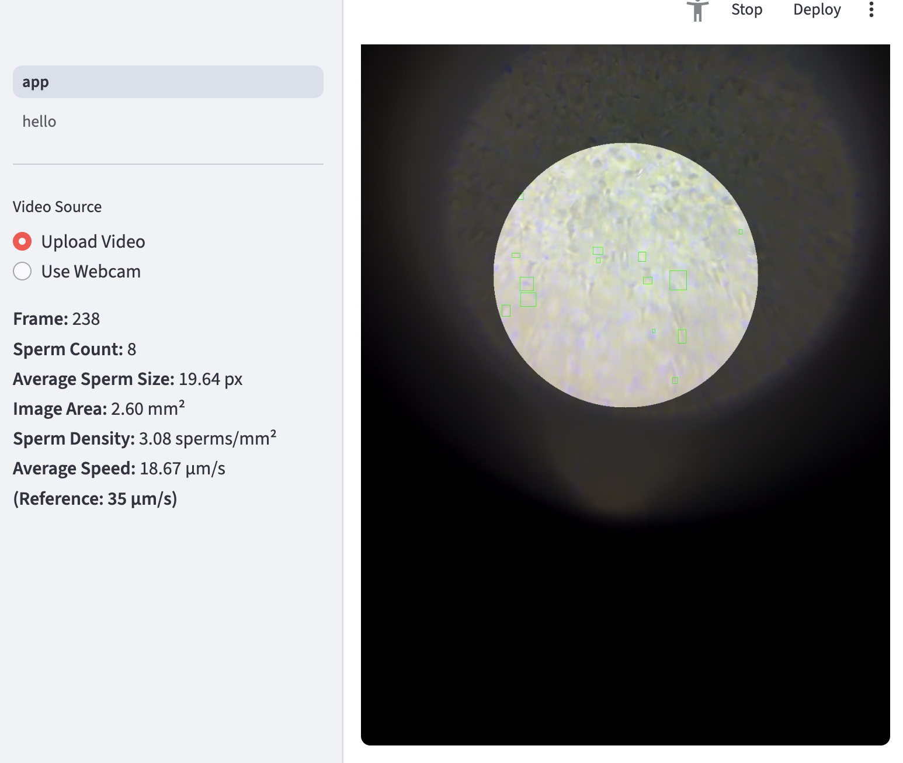

# streamlit-casa
A simple Streamlit app to run computer-aided sperm analysis

# System requirements
python >= 3.10

# Installation

if you have `uv` installed, you can run the app with:

```bash
uv run streamlit app.py
```

if you don't have `uv` installed, you can install uv with:

```bash
pip install uv
```

then run the app with:

```bash
uv run streamlit app.py
```

# Usage

1. Upload a video file
2. The system will process the video and show the results in the left panel
3. When the whole video is processed, the system will show the summary in the center with a downloadable csv file

# Example

